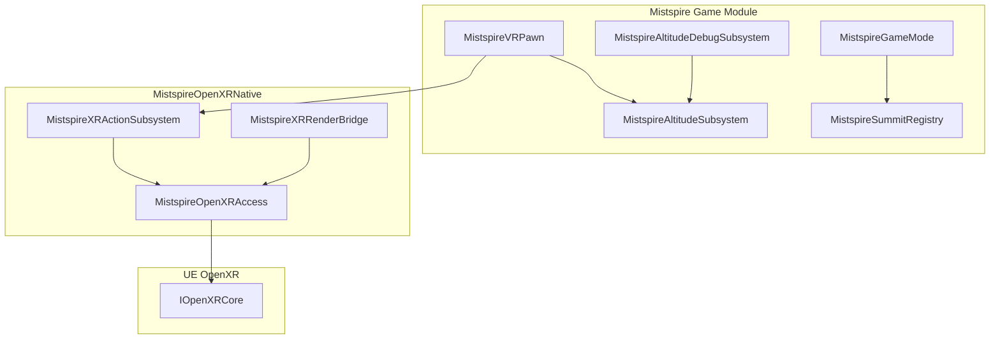

# Mistspire Architecture

## Overview

## Modules

| Module | Responsibility |
|--------|----------------|
| `Mistspire` | VR pawn, locomotion stubs, altitude scoring, summit registry, debug HUD |
| `MistspireOpenXRNative` | Read UE OpenXR handles; action set `mistspire_gameplay`; render-thread probe |

## OpenXR rules

1. Never create a parallel `XrInstance` / `XrSession` when UE OpenXR plugins are enabled.
2. Never call `xrWaitFrame` from `MistspireOpenXRNative` in shipping builds.
3. Bindings live in `interaction_profiles/openxr/` for all major PCVR controllers.

## Scoring

- **Personal best:** max world-space Z of the VR pawn root (centimeters).
- **Summits:** `AMistspireSummitMarker` + `UMistspireSummitRegistry` for authored peaks.

## World streaming

`Main_WP` uses World Partition (see [WORLD_DESIGN.md](WORLD_DESIGN.md)). Binary maps are not in git — build in editor.

## Extension points

| Future | Hook |
|--------|------|
| Multiplayer | Replicate `UMistspireAltitudeSubsystem` |
| Hand tracking | UE `OpenXRHandTracking` + custom gestures |
| Eye-tracked VRS | `UMistspireXRRenderBridge` + NVAPI |
| LBE operator | [tools/operator/README.md](../tools/operator/README.md) |
