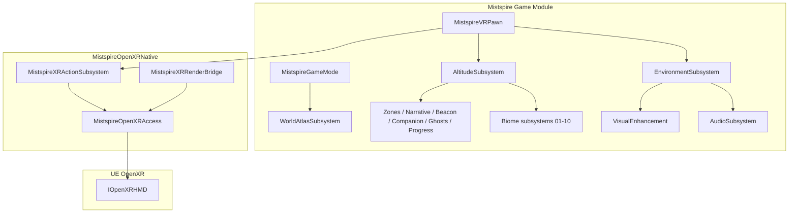

# Mistspire Architecture

## Overview

Mistspire is a UE **5.8** PCVR vertical exploration game. Score is personal-best world-space Z (cm). OpenXR input and rendering go through UE’s OpenXR plugins; `MistspireOpenXRNative` only reads session handles and drives the `mistspire_gameplay` action set.

## Modules

| Module | Responsibility |
|--------|----------------|
| `Mistspire` | VR pawn, altitude/survival, biomes, weather, immersion stack, world atlas/interiors, audio, visuals, debug console |
| `MistspireOpenXRNative` | Read UE OpenXR handles; action set `mistspire_gameplay`; render-thread probe |

## Core gameplay systems

| Area | Types | Notes |
|------|-------|-------|
| Altitude / score | `UMistspireAltitudeSubsystem`, `UMistspireAltitudeDebugSubsystem`, `AMistspireSummitMarker`, `UMistspireSummitRegistry` | PB altitude (cm); authored summits |
| VR pawn | `AMistspireVRPawn` | Climb, grapple, glider, teleport, stamina/O₂, wrist HUD |
| Environment | `UMistspireEnvironmentSubsystem` | Weather (Clear / MistStorm / Electric / ZenithGlow), wind, mist |
| Biomes | `UMistspireBiomeMist` … `UMistspireBiomePinnacle` | 10 altitude bands, 0–20 km; hazards on upper bands |
| Immersion | Zone, Narrative, Beacon, Companion, Ghost, Progress subsystems | See [IMMERSION.md](../gameplay/IMMERSION.md) |
| World scale | `UMistspireWorldAtlasSubsystem`, `UMistspireInteriorSubsystem` | 12 districts, enterable buildings — [BUILDINGS_AND_INTERIORS.md](../gameplay/BUILDINGS_AND_INTERIORS.md) |
| Audio / visuals | `UMistspireAudioSubsystem`, `UMistspireVisualEnhancementSubsystem` | Biome/physiology buses; per-biome post-process |

## OpenXR rules

1. Never create a parallel `XrInstance` / `XrSession` when UE OpenXR plugins are enabled — use `FMistspireOpenXRAccess` + `IOpenXRHMD`.
2. Never call `xrWaitFrame` from `MistspireOpenXRNative` in shipping builds.
3. Bindings live in `interaction_profiles/openxr/` for Meta, Valve, HTC, and KHR simple controllers.

## Scoring

- **Personal best:** max world-space Z of the VR pawn root (centimeters).
- **Summits:** `AMistspireSummitMarker` + `UMistspireSummitRegistry` for authored peaks.

## World streaming

`Main_WP` is a World Partition map under `game/Content/Maps/` (Git LFS). Authoring notes: [WORLD_DESIGN.md](../gameplay/WORLD_DESIGN.md) and [game/Content/Maps/README.md](../../game/Content/Maps/README.md).

## CI (hosted runners)

GitHub Actions cannot build the Unreal editor project. Validate JSON, shellcheck, pinned Ruff on `scripts/*.py`, and cmake-build `native/xr-sandbox`. CodeQL analyzes **cpp** after building that sandbox. See [.github/codeql/README.md](../../.github/codeql/README.md).

## Extension points

| Area | Hook |
|------|------|
| Multiplayer | `UMistspireGameInstance` / player state sync (host/join still config-gated) |
| Hand tracking | UE `OpenXRHandTracking` + custom gestures |
| Eye-tracked VRS | `UMistspireXRRenderBridge` + NVAPI |
| LBE operator | [tools/operator/README.md](../../tools/operator/README.md) |
