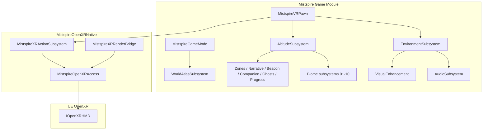

# Mistspire Architecture

## Overview

Mistspire is a UE **5.8** PCVR vertical exploration game. Score is personal-best world-space Z (cm). OpenXR input and rendering go through UE’s OpenXR plugins; `MistspireOpenXRNative` only reads session handles and drives the `mistspire_gameplay` action set.

## Modules

| Module | Responsibility |
|--------|----------------|
| `Mistspire` | VR pawn, altitude/survival, biomes, weather, immersion stack, world atlas/interiors, audio, visuals, debug console |
| `MistspireOpenXRNative` | Read UE OpenXR handles; action set `mistspire_gameplay`; render-thread probe |

## Core gameplay systems

| Area | Types | Notes |
|------|-------|-------|
| Altitude / score | `UMistspireAltitudeSubsystem`, `UMistspireAltitudeDebugSubsystem`, `AMistspireSummitMarker`, `UMistspireSummitRegistry` | PB altitude (cm); authored summits |
| VR pawn | `AMistspireVRPawn` | Climb, grapple, glider, teleport, stamina/O₂, wrist HUD |
| Environment | `UMistspireEnvironmentSubsystem` | Weather (Clear / MistStorm / Electric / ZenithGlow), wind, mist |
| Biomes | `UMistspireBiomeMist` … `UMistspireBiomePinnacle` | 10 altitude bands, 0–20 km; hazards on upper bands |
| Immersion | Zone, Narrative, Beacon, Companion, Ghost, Progress subsystems | See [IMMERSION.md](../gameplay/IMMERSION.md) |
| World scale | `UMistspireWorldAtlasSubsystem`, `UMistspireInteriorSubsystem` | 12 districts, enterable buildings — [BUILDINGS_AND_INTERIORS.md](../gameplay/BUILDINGS_AND_INTERIORS.md) |
| Audio / visuals | `UMistspireAudioSubsystem`, `UMistspireVisualEnhancementSubsystem` | Biome/physiology buses; per-biome post-process |

## OpenXR rules

Canonical agent rules (no second session / no shipping `xrWaitFrame` / action set `mistspire_gameplay`): [AGENTS.md](../../AGENTS.md). Binding JSON index: [interaction_profiles/openxr/](../../interaction_profiles/openxr/). Runtime notes: [OPENXR_RUNTIMES.md](OPENXR_RUNTIMES.md).

## Engine targets (Win64 / Linux)

`game/Mistspire.uproject` `TargetPlatforms` is **Linux** and **Win64** only (not Mac, not Android).

| Platform | RHI / shader models | Config |
|----------|---------------------|--------|
| Linux | Vulkan **SM5 + SM6** | `[/Script/LinuxTargetPlatform.LinuxTargetSettings]` in `game/Config/DefaultEngine.ini` |
| Win64 | D3D12 **SM5 + SM6** (D3D11 SM5 retained); default graphics RHI left at engine default | `[/Script/WindowsTargetPlatform.WindowsTargetSettings]` |

Texture streaming pool is **16000** MB (`r.Streaming.PoolSize` under RendererSettings). OpenXR stays enabled via `[/Script/OpenXRHMD.OpenXRSettings]`.

Hosted GitHub runners still do not cook Unreal; local editor/cook on Windows or native Linux is required to validate RHIs.

## Scoring

- **Personal best:** max world-space Z of the VR pawn root (centimeters).
- **Summits:** `AMistspireSummitMarker` + `UMistspireSummitRegistry` for authored peaks.

## World streaming

`Main_WP` is a World Partition map under `game/Content/Maps/` (Git LFS). Authoring notes: [WORLD_DESIGN.md](../gameplay/WORLD_DESIGN.md) and [game/Content/Maps/README.md](../../game/Content/Maps/README.md).

## CI (hosted runners)

Unreal editor builds aren't available on hosted runners. See [CONTRIBUTING.md](../../CONTRIBUTING.md) and [.github/codeql/README.md](../../.github/codeql/README.md) for what CI validates and why.

## Extension points

| Area | Hook |
|------|------|
| Multiplayer | `UMistspireGameInstance` / player state sync (host/join still config-gated) |
| Hand tracking | UE `OpenXRHandTracking` + custom gestures |
| Eye-tracked VRS | `UMistspireXRRenderBridge` + NVAPI |
| LBE operator | [tools/operator/README.md](../../tools/operator/README.md) |
